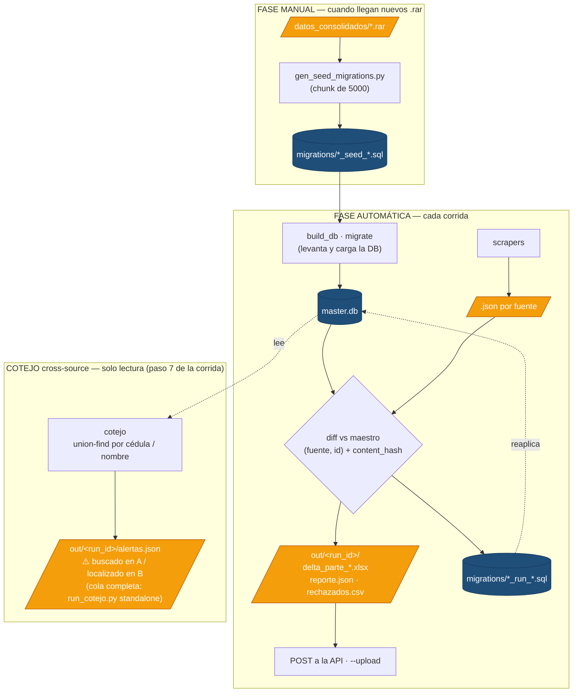
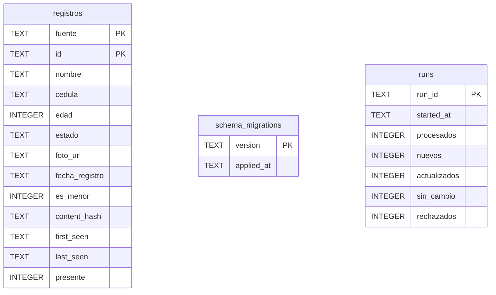
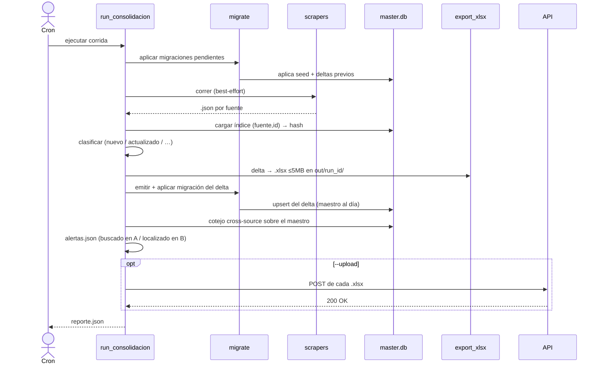
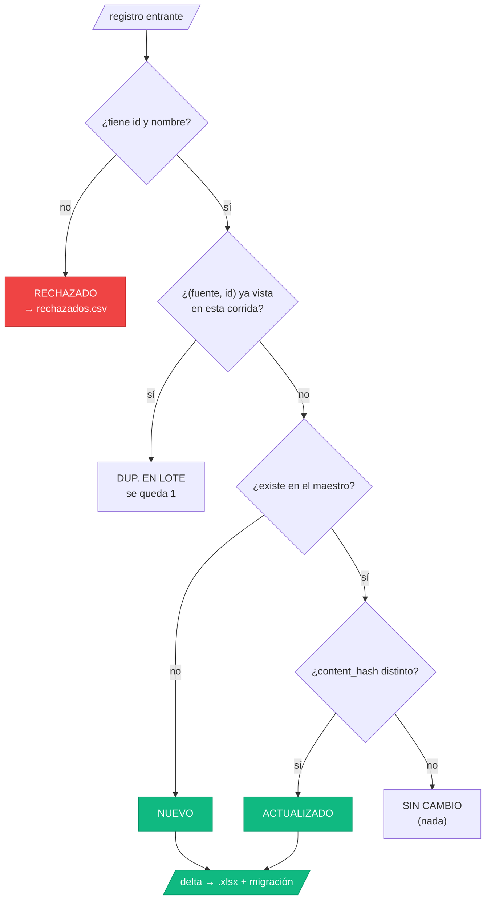
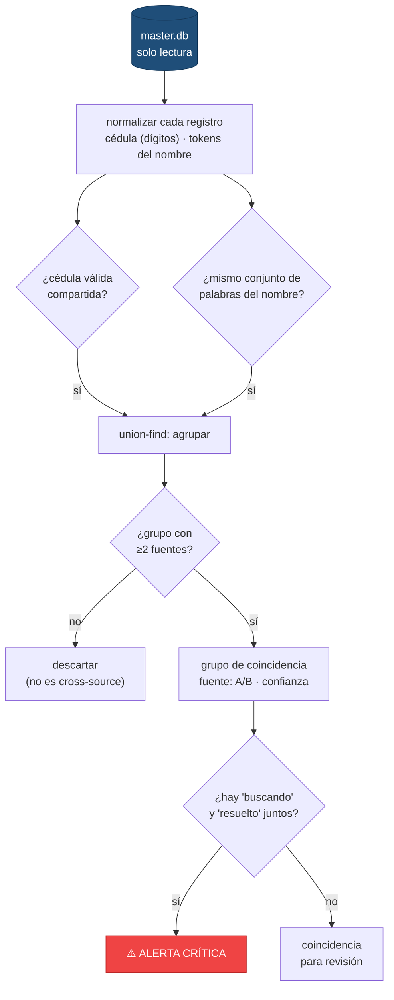

# Consolidator

Pipeline que mantiene un **maestro** de personas (desaparecidos/localizados del
terremoto de Venezuela) en SQLite y, en cada corrida, produce **solo el delta**
(altas + cambios) como archivos `.xlsx` ≤5 MB, listos para subir a la API.

En vez de regenerar y subir las ~241 000 filas completas cada día, el maestro
persiste y solo se emite **lo que cambió** respecto a la corrida anterior. En
régimen normal eso son unos pocos KB en un solo `.xlsx`.

---

## Índice
- [Idea en una imagen](#idea-en-una-imagen)
- [Esquema del maestro (16 columnas)](#esquema-del-maestro-16-columnas)
- [Estructura del módulo](#estructura-del-módulo)
- [Requisitos e instalación](#requisitos-e-instalación)
- [Las dos fases: seed (manual) y corrida (automática)](#las-dos-fases)
- [Entradas y salidas](#entradas-y-salidas)
- [Comandos](#comandos)
- [El embudo del diff](#el-embudo-del-diff)
- [Modelo de migraciones](#modelo-de-migraciones)
- [Configuración](#configuración)
- [Tests](#tests)
- [Qué va a git y qué no](#qué-va-a-git-y-qué-no)
- [Pendiente](#pendiente)
- [Gotchas](#gotchas)

---

## Idea en una imagen



El maestro es **el producto de aplicar las migraciones en orden**: el `.db` no se
versiona, se reconstruye.

---

## Esquema del maestro (16 columnas)

Toda fuente se normaliza a este esquema (el de la tabla `missing_persons`, que la
API ya consume):

```
id, nombre, cedula, edad, ultima_ubicacion, telefono_contacto, observaciones,
estado, ubicacion_encontrado, encontrado_por, encontrado_por_cedula, foto_url,
fecha_registro, fecha_actualizacion, es_menor, fuente
```

En la tabla `registros` se añaden metadatos de control:

| Columna | Para qué |
|---|---|
| `content_hash` | hash del contenido (excluye `fecha_actualizacion`) → detecta cambios reales |
| `first_seen` | primer avistamiento; **nunca** se sobrescribe |
| `last_seen` | último avistamiento |
| `presente` | visto en la última corrida (reservado para "ausentes", aún no usado) |

- **Llave de identidad:** `(fuente, id)`.
- Registros **sin `fuente`** → se etiquetan `"desconocida"` (no se descartan).
- Se **rechaza** solo lo que no se puede identificar: sin `id` o sin `nombre`.

### Tablas del maestro (SQLite)

Tres tablas independientes (sin relaciones entre sí). `registros` es el maestro;
`schema_migrations` rastrea lo aplicado; `runs` es la bitácora de corridas.



> `registros` lista las columnas de control + una muestra de las 16 canónicas
> (las demás —`ultima_ubicacion`, `telefono_contacto`, `observaciones`, etc.— se
> omiten en el diagrama por espacio).

---

## Estructura del módulo

```
consolidator/
├─ README.md
├─ requirements.txt              openpyxl, requests
├─ build_db.py                   [auto] levanta+carga master.db (aplica migraciones)
├─ run_consolidacion.py          [auto] orquestador de la corrida (incl. cotejo)
├─ run_cotejo.py                 [análisis] cotejo cross-source standalone (solo lectura)
├─ scripts/
│  └─ gen_seed_migrations.py     [manual] .rar → migraciones de seed
├─ lib/
│  ├─ registros.py               16 columnas canónicas + content_hash + normalize
│  ├─ migrate.py                 runner de migraciones (schema_migrations)
│  ├─ diff.py                    clasificación entrantes vs maestro
│  ├─ export_xlsx.py             delta → xlsx particionado ≤MB
│  ├─ api.py                     subida del delta a la API
│  └─ cotejo.py                  agrupación cross-source + alertas críticas
├─ migrations/
│  ├─ 0001_init.sql              esquema (registros, schema_migrations, runs)
│  ├─ 00NN_seed_*.sql            seed chunkeado (≈49 archivos)   ← git
│  └─ 00NN_run_<fecha>_*.sql     deltas diarios                  ← git
├─ tests/                        29 tests
├─ master.db                     [gitignored] maestro SQLite (~120 MB, regenerable)
└─ out/<run_id>/                 [gitignored] salida de cada corrida
```

---

## Requisitos e instalación

- **Python 3.12** + un **venv** (PEP 668 bloquea instalar global).
- **`unrar`** en el sistema (para leer los `.rar` del seed).
- **Node 18+** y **Playwright** solo si vas a correr los scrapers en vivo.

```bash
python3 -m venv .venv
.venv/bin/pip install -r consolidator/requirements.txt
```

Todo se corre con `.venv/bin/python` (incluye stdlib + openpyxl + requests).

### SQLite

El **motor SQLite ya viene incluido en Python** (módulo `sqlite3` de la stdlib),
así que el pipeline **no requiere instalar nada extra** para funcionar.

Solo necesitas el **CLI `sqlite3`** si quieres abrir/inspeccionar `master.db` a
mano (`sqlite3 consolidator/master.db "SELECT COUNT(*) FROM registros;"`):

**Linux:**
```bash
sudo apt install sqlite3        # Debian / Ubuntu
sudo dnf install sqlite          # Fedora / RHEL
sudo pacman -S sqlite            # Arch
```

**Windows:**
```powershell
winget install SQLite.SQLite     # o: choco install sqlite
```
…o descarga los *command-line tools* (`sqlite-tools-win-x64`) desde
<https://www.sqlite.org/download.html>, descomprime y agrega la carpeta al `PATH`.

Referencias: [descargas](https://www.sqlite.org/download.html) ·
[uso del CLI](https://sqlite.org/cli.html).

---

## Las dos fases

### Fase manual — generar el seed

> ⚠️ **Normalmente NO necesitas correr esto.** El seed **ya está generado y
> versionado** en `migrations/` (`0002_seed_*.sql` … ≈49 archivos): un clon nuevo
> solo necesita `build_db.py` para tener el maestro. Este script **solo** se vuelve
> a correr cuando llegan **nuevos `.rar`** a `datos_consolidados/` (regenera el seed
> desde cero a partir de todos los `.rar`).

Lee todos los `.rar`, normaliza y reescribe las migraciones de seed (lotes de 5000):

```bash
.venv/bin/python consolidator/scripts/gen_seed_migrations.py
```

### Fase automática — la corrida
Lo que se ejecuta a diario. **Antes de scrapear, levanta y carga la DB**
(aplicar migraciones); luego scrapea, contrasta y emite el delta:

```bash
.venv/bin/python consolidator/run_consolidacion.py
```

### Anatomía de una corrida



---

## Entradas y salidas

### Entradas

| Qué | De dónde | Quién la usa |
|---|---|---|
| `.rar` (con `todos_registros.json`, 16-col) | `datos_consolidados/*.rar` | seed (manual) |
| `.json` por fuente de los scrapers | `Amilkir/personas_venezuela.json`, `chiki/*.json` | corrida (ingesta) |
| Override de fuentes | `--input a.json b.json` | corrida (pruebas) |
| Credenciales API | variables de entorno (ver [Configuración](#configuración)) | subida |

### Salidas

| Qué | Dónde | ¿git? |
|---|---|---|
| Migraciones de seed | `migrations/00NN_seed_*.sql` | ✅ |
| Migración del delta de la corrida | `migrations/00NN_run_<fecha>_*.sql` | ✅ |
| Maestro SQLite | `master.db` | ❌ (regenerable) |
| Delta en Excel (≤5 MB c/u) | `out/<run_id>/delta_parte_NNN.xlsx` | ❌ |
| Reporte de la corrida | `out/<run_id>/reporte.json` | ❌ |
| Registros rechazados | `out/<run_id>/rechazados.csv` | ❌ |
| **Alertas del cotejo** (→ equipo BBDD) | `out/<run_id>/alertas.json` | ❌ |
| Subida a la API (solo el delta) | POST a `post_carga_doc.php` (con `--upload`) | — |
| Cola completa de coincidencias (standalone) | `out/cotejo_<run_id>/coincidencias.json` | ❌ |

**`reporte.json`** (ejemplo):
```json
{
  "run_id": "20260628T230000",
  "started_at": "2026-06-28T23:00:00+00:00",
  "procesados": 41200, "nuevos": 312, "actualizados": 88,
  "sin_cambio": 40788, "duplicados_lote": 11, "rechazados": 1,
  "delta_total": 400,
  "archivos_xls": ["delta_parte_001.xlsx"],
  "cotejo": {"grupos_coincidencia": 50802, "alertas_criticas": 8551,
             "por_confianza": {"fuerte": 3, "nombre": 50799}},
  "subida": [{"file": "delta_parte_001.xlsx", "status": 200, "ok": true, "resp": "..."}]
}
```

---

## Comandos

```bash
# --- seed (manual · ya generado; correr SOLO si llegan nuevos .rar) ---
.venv/bin/python consolidator/scripts/gen_seed_migrations.py [--chunk-size 5000]

# --- construir/cargar la DB (auto) ---
.venv/bin/python consolidator/build_db.py            # aplica migraciones pendientes
.venv/bin/python consolidator/build_db.py --fresh     # reconstruye desde cero

# --- corrida (incluye el cotejo como paso 7) ---
.venv/bin/python consolidator/run_consolidacion.py                 # completa (scrapea)
.venv/bin/python consolidator/run_consolidacion.py --no-scrape --input datos.json
.venv/bin/python consolidator/run_consolidacion.py --upload         # sube el delta a la API
.venv/bin/python consolidator/run_consolidacion.py --max-mb 9       # cambia el tope del xlsx
.venv/bin/python consolidator/run_consolidacion.py --no-cotejo      # omite el cotejo

# --- cotejo standalone (cola COMPLETA de coincidencias, on-demand) ---
.venv/bin/python consolidator/run_cotejo.py                 # coincidencias.json (todos)
.venv/bin/python consolidator/run_cotejo.py --solo-alertas   # solo alertas críticas

# --- tests ---
.venv/bin/python -m unittest discover -s consolidator/tests -t .
```

| Flag | Script | Default | Para qué |
|---|---|---|---|
| `--no-scrape` | run_consolidacion | — | usa salidas existentes, no corre scrapers |
| `--input` | run_consolidacion | fuentes fijas | JSONs a ingerir (pruebas) |
| `--upload` | run_consolidacion | off | sube el delta a la API (producción) |
| `--max-mb` | run_consolidacion | 5 | tope de tamaño por `.xlsx` |
| `--no-cotejo` | run_consolidacion | — | omite el cotejo cross-source |
| `--fresh` | build_db | — | borra `master.db` y reconstruye |
| `--chunk-size` | gen_seed_migrations | 5000 | filas por migración de seed |
| `--solo-alertas` | run_cotejo | — | emite solo las alertas críticas |

---

## El embudo del diff

Cada registro entrante se clasifica contra el maestro por `(fuente, id)` +
`content_hash`:



**delta = NUEVOS + ACTUALIZADOS.** Propiedad clave: correr dos veces con los
mismos datos da **delta 0** (idempotente), porque `content_hash` excluye los
timestamps de re-scrape.

---

## Modelo de migraciones

El maestro se reconstruye aplicando migraciones en orden. Hay tres tipos, todas
**idempotentes** (`ON CONFLICT(fuente,id) DO UPDATE`, sin tocar `first_seen`):

```
0001_init.sql              esquema
0002..00NN_seed_*.sql      el consolidado base (chunkeado)
00NN_run_<fecha>_*.sql     el delta de cada corrida (historial)
```

- `migrate.py` registra cada `version` aplicada en `schema_migrations` y nunca la
  reaplica.
- `next_version()` numera la siguiente como `máximo + 1`.
- Reconstruir en otra máquina: clonar → `gen_seed_migrations.py` (desde los `.rar`)
  → `build_db.py`.

---

## Cotejo cross-source

Capa de análisis de **solo lectura** sobre el maestro (no fusiona ni modifica
nada). Detecta la **misma persona reportada en fuentes distintas** y marca las
**alertas críticas**: *buscado en una fuente, localizado en otra*.

**Corre como parte de cada corrida** (paso 7 de `run_consolidacion.py`), después
de aplicar el delta: escribe **`out/<run_id>/alertas.json`** (solo las críticas, lo
accionable) y suma el conteo a `reporte.json`. Se desactiva con `--no-cotejo`.

> 📤 **Entrega:** `alertas.json` **no se sube a la API** (la API es solo para el
> delta del esquema `missing_persons`). Es un artefacto de **revisión humana** que
> se **entrega al equipo de Base de datos** para que actúe sobre las coincidencias
> (confirmar/descartar el match, reunir casos "buscado en A / localizado en B").

La **cola completa** de coincidencias (todos los grupos, no solo alertas) se saca
**on-demand** con el script standalone:

```bash
.venv/bin/python consolidator/run_cotejo.py                 # coincidencias.json (todos)
.venv/bin/python consolidator/run_cotejo.py --solo-alertas   # solo las críticas
```

**Cómo agrupa** (union-find por claves, O(n), sin comparar todos los pares):



| Señal | Confianza |
|---|---|
| Cédula válida compartida (≥6 dígitos, sin `V-`) | `fuerte` |
| Mismo conjunto de palabras del nombre (sin acentos/orden, sin `DE/LA/…`, ≥2 tokens) | `nombre` |

**Alerta crítica:** dentro de un grupo cross-source, alguien `buscando`
(Desaparecido) **y** alguien `resuelto` (Localizado/Encontrado/Hospitalizado/
Fallecido).

**Salida** en `out/cotejo_<run_id>/`: `coincidencias.json` (cola de revisión,
alertas primero) + `reporte.json`. Cada grupo trae el campo **`fuente`
concatenado** (`"redayuda/terremoto"`) — la persona aparece en varias fuentes.
Esto **no** se escribe en el maestro: el maestro conserva las filas originales por
`(fuente, id)` (si se fusionaran, el diff incremental las recrearía cada corrida).

> **Precisión:** como las cédulas casi siempre vienen vacías, el grueso del match
> es por nombre → los grupos grandes pueden incluir **homónimos**. Revisar
> primero los de `n=2` (los más confiables). Mejora futura: exigir corroboración
> por ubicación (`ciudad`/`ultima_ubicacion`) para subir la precisión de los
> grupos grandes.

---

## Configuración

La subida a la API (`--upload`) se configura por **variables de entorno**. Defínelas
en un archivo **`.env`** en la raíz del repo (copia la plantilla y completa la clave):

```bash
cp .env.example .env      # luego edita AEV_API_KEY
```

| Variable | Default (fallback) |
|---|---|
| `AEV_API_URL` | `https://aquiestoyvenezuela.com/api/post_carga_doc.php` |
| `AEV_API_KEY` | (clave heredada de `send_to_api.py`) |
| `AEV_ID_USUARIO` | `1` |
| `AEV_ID_HOSPITAL` | `1` |

> `.env` está **gitignoreado**; nunca subas la clave. Solo se versiona `.env.example`.

### Cargar las variables antes de correr

El script **auto-carga** el `.env` de la raíz si existe, así que normalmente basta
con tenerlo. Si prefieres exportarlas a mano (o en CI), hazlo **antes** de correr:

**Linux / macOS (bash · zsh):**
```bash
set -a; source .env; set +a          # carga todo el .env al entorno
# o una sola variable:
export AEV_API_KEY="tu-api-key"
```

**Windows (PowerShell):**
```powershell
Get-Content .env | Where-Object { $_ -match '^\s*[^#].+=' } | ForEach-Object {
    $k, $v = $_ -split '=', 2
    [Environment]::SetEnvironmentVariable($k.Trim(), $v.Trim())
}
# o una sola variable:
$env:AEV_API_KEY = "tu-api-key"
```

Las variables ya definidas en el entorno **tienen prioridad** sobre el `.env`.

---

## Tests

```bash
.venv/bin/python -m unittest discover -s consolidator/tests -t .
```

| Suite | Cubre |
|---|---|
| `test_migrate` | orden de aplicación, registro, idempotencia, incremental |
| `test_diff` | las 5 categorías del embudo |
| `test_export` | xlsx + partición por tamaño |
| `test_api` | subida (con `requests.post` mockeado) |
| `test_run_consolidacion` | corrida end-to-end + idempotencia + subida integrada |
| `test_cotejo` | tokens/cédula/estado + agrupación cross-source + alerta crítica |

29 tests, hermético (dirs temporales; no toca el repo ni la red).

---

## Qué va a git y qué no

**Va a git:** código, `migrations/*.sql` (esquema + seed + deltas), tests, README.
**No va a git** (en `.gitignore`): `master.db`, `out/`, `.venv/`, `__pycache__/`,
y los binarios pesados de `datos_consolidados/` (`*.zip`, `*.xlsx`; el `.rar` sí se
versiona como fuente del seed).

El `.db` (~120 MB) supera el límite de 100 MB de GitHub: por eso es regenerable y
nunca se commitea.

---

## Pendiente

- **Ausentes** (`presente=0`): marcar a quien está en el maestro pero no apareció
  en la corrida. Pendiente hasta tener scrapers en vivo + señal de "scrape completo
  por fuente" (si no, un scraper que falla marcaría a miles como ausentes). La
  columna `presente` ya existe.
- **Cotejo — mejora de precisión**: el [cotejo cross-source](#cotejo-cross-source)
  ya existe; falta subir la precisión de los grupos grandes con corroboración por
  ubicación (hoy el match por nombre puede agrupar homónimos).

---

## Gotchas

- **Correr siempre con `.venv/bin/python`** (openpyxl/requests no están en el
  Python del sistema por PEP 668).
- **`gen_seed_migrations.py` es manual**, no parte de la corrida automática.
- **El seed lee `.rar`** (necesita `unrar`); el `.zip`/`.xlsx` de
  `datos_consolidados/` son redundantes y están gitignorados.
- **Los scrapers (paso 2) necesitan red/Node/Playwright** y no se prueban en
  entornos sin acceso; el resto del pipeline sí es testeable con `--no-scrape`.
- **`--upload` pega a producción** (opt-in a propósito).
